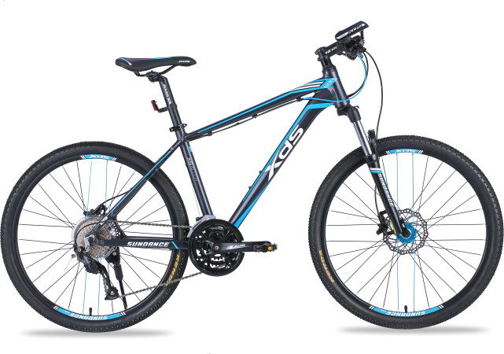
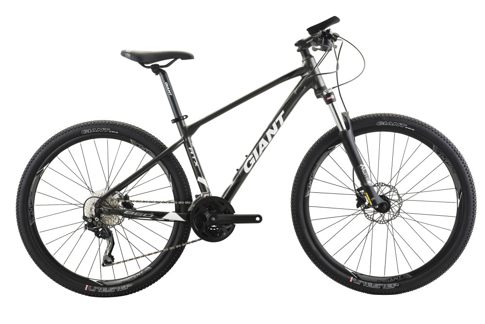

# Pick my first cycle
## 计划
想买车这个想法由来已久，之前是一直骑膜拜，真的是磨屁股，还骑不快，想着是时候升级一下装备了，然后最近也打算来一个半程川藏线然后转到丽江。

现在自行车品牌真的是五花八门的，不过当你仔细筛选一下的话其实就几个比较靠谱的：

1. GIANT(捷安特)
2. 美利达
3. 喜德盛

欧美不考虑（太贵），永久/凤凰不考虑（太老）

最后在这三个品牌的里面筛选。

大概查了一下，现在自行车主要分： 山地车，公路车，旅行车等

山地车 -- 轮胎比较宽抓地力比较长，带减震（前叉锁死）。适合混合路面/山地路面
公路车 -- 适合路况较好的公路行驶。
旅行车 -- 一定程度考虑长途骑行的舒适度。

然后 车子还分车架成分，烧钱的碳纤维和普通的铝合金

考虑到自己平时比较作，然后又要骑路面情况比较复杂的川藏线，资金还有限。所以果断定位在了 山地车 -- 铝合金车架。

## 网上筛选
大概定位好车子后我就开始疯狂的筛选备选款式了。这些自行车厂商的网站一般都会有所有车子的详细资料有些还可以在线对比。

最后初步赛选出来了两款比较合理的车：

喜德盛的传奇系列：

捷安特的ATX系列：

## 实地选车
实地选车大概经理了一周左右吧，刚开始就一直想去看喜德盛的车但是喜德盛的专卖店9点就关门了，然后我从公司带专卖店还得有一个多小时的车程（我还想着共享单车去），直接到时我又一次去了过后只能眼巴巴的盯着玻璃后面的自行车。后面选择了先去看捷安特的，我选择了一个离我住的地方没有多远的专卖店。到店后店主正在组装一台自行车，看着挺忙的，等了一会。师傅很热情的给我介绍了基本所有的车型，但我当时没有问我网上选好的，所以我第二天又过来了，直接问了ATX777 然后他给我说ATX860 是一样的听他详细给我介绍了一帆过后都打算买了，但是这个专卖店没有M号只有S号，很尴尬，本来想让店主去定的，但是他直接给我来了一句你骑S号也行。。。怎么能随便，所以果断换店了。