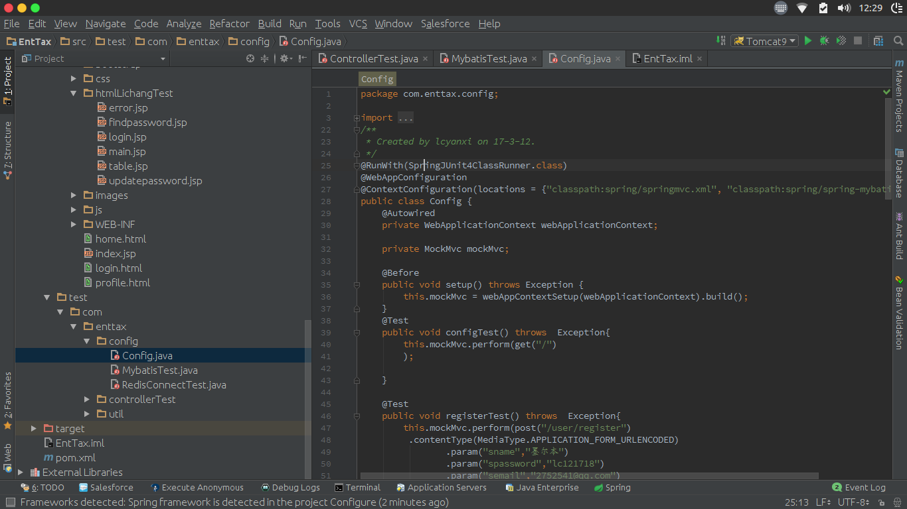
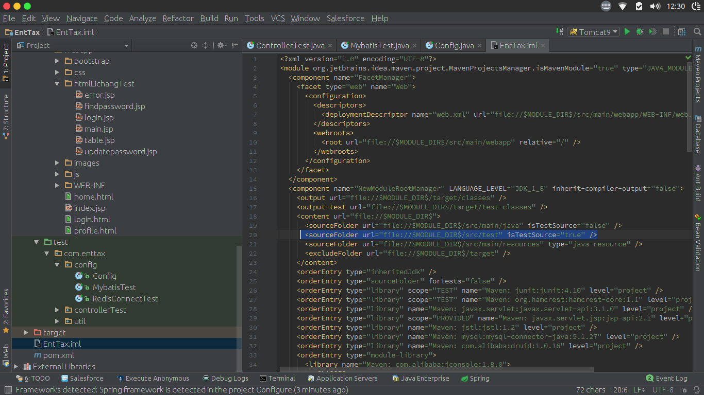
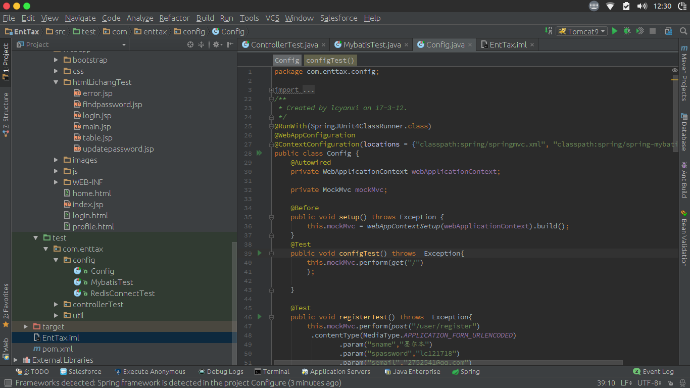

## 概述

> 我在 idea 打开项目的时候，突然发现我的测试代码目录不被识别了，@Test 注解旁边也没有了 运行按钮了。。。就像下面
> 

## 解决方法

> 修改项目的 `.iml` 文件，加上 `test` 的目录到里面

```xml
<sourceFolder url="file://$MODULE_DIRS/src/test" isTestSource="true" />
```



