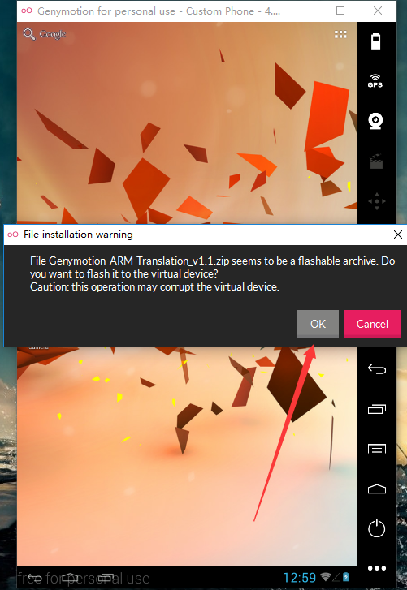
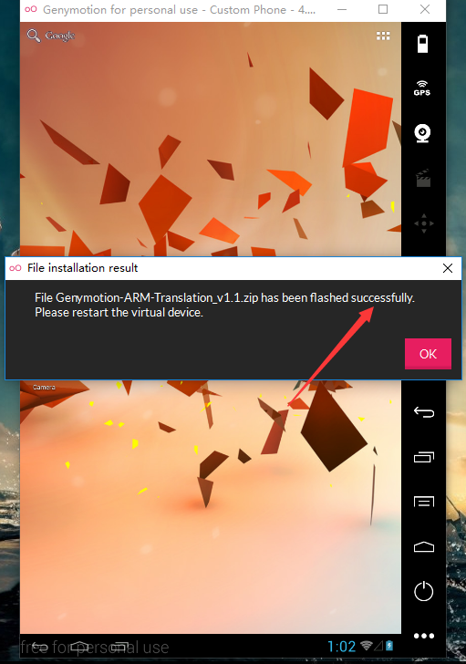
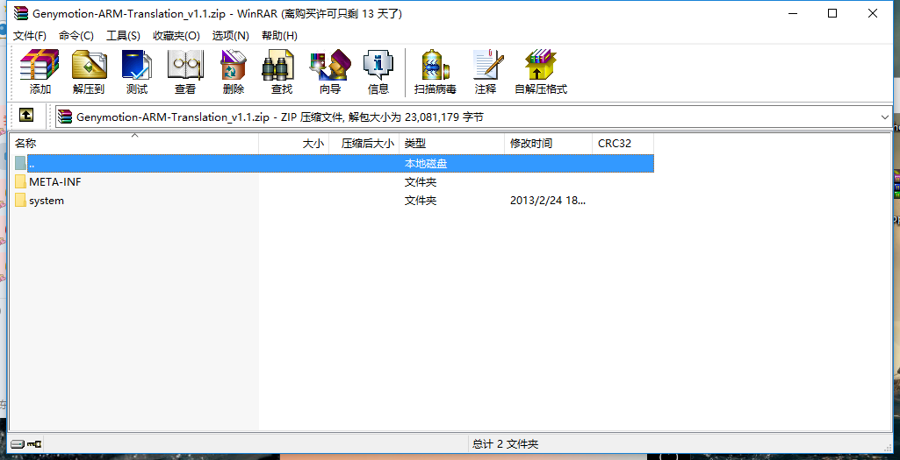

# 概述

> `Android`用`Genymotion` 调试的时候，如果有`.so`的库的话，出现`Failure [INSTALL_FAILED_NO_MATCHING_ABIS]` 错误，并且始终安装不上。一阵百度过后总算找到错误了，是因为模拟器实在`x86`的处理器上运行，而手机一般都是`RAM`架构的，所以得把模拟器刷成`ARM`的才行。

# 下载 Genymotion-ARM-Translation_v1.1.zip

> 可以到[官网下载](https://filetrip.net/dl?4SUOrdcMRv) ，如果嫌速度太慢也得可以到[百度云](http://pan.baidu.com/s/1miLa9mS)

# 自动　 Flash

> 将下载好的`Genymotion-ARM-Translation_v1.1.zip` 拖拽到 Genymotion 模拟器里面,然后会有如下提示：
> 

> 然后点击`OK`开始 flash,最后如果一切顺利的话，将会看到如下的成功提示：
> 

# 手动　 Flash

> 本来`Genymotion` 是支持自动 Flash 的但是有些时候自动 flash 就是会失败，所以这是后就只有手动来 Flash 了。

## Windows 的同学

> 首先`cmd`进到安装的`SDK`目录下的 `platform-tools`目录：

> 输入：`adb shell`

> 输入：`sh /system/bin/flash-archive.sh /sdcard/Download/Genymotion-ARM-Translation_v1.2.zip`

> 最后重启模拟器

## Ubuntu Linux 的同学

> 首先你得修改`bashrc`文件：`sudo gedit ~/.bashrc` 在文件末尾追加：
> `export PATH=$PATH:/your_android-sdk-linux_path/tools/ export PATH=$PATH:/your_android-sdk-linux_path/platform-tools/`
> 然后同步修改的文件：`source ~/.bashrc`

> 在保证你只有一个模拟器的情况下输入:`adb shell`

> 然后输入：`sh /system/bin/flash-archive.sh /sdcard/Download/Genymotion-ARM-Translation_v1.2.zip`

> 最后重启模拟器。

#最坑的地方 Unzip Failed

> 如果上面的自动和手动的方法都试过了都不好使的情况下，你就应该检查一下`Genymotion-ARM-Translation_v1.1.zip` 文件是否完整。可能是因为网络的原因我第一次下载的文件不是完整的，整整坑了我两天，下面给出完整的截图：
> 
